# 🚀 LAMP Stack Setup

## 📖 Overview
This guide provides step-by-step instructions for setting up a **LAMP (Linux, Apache, MySQL, PHP) stack** on an **AWS EC2 Ubuntu instance**. Each section includes commands, configurations, and verification steps with images.

---

## 🛠️ Part 1: Setting Up LAMP Stack

### 🔹 IAM User and Group Setup
- Created an **IAM user**.
- Created a **user group** and granted **admin access** permissions.
- Added the **IAM user** to the group.

📸 **Screenshot:**  
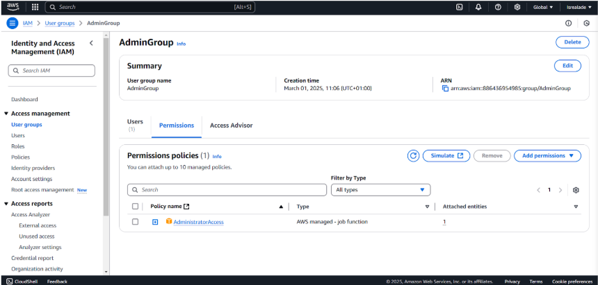

---

### 🔹 EC2 Instance Creation
- Launched an **EC2 instance** using **Ubuntu**.
- Created a **key pair** during instance setup.

📸 **Screenshot:**  
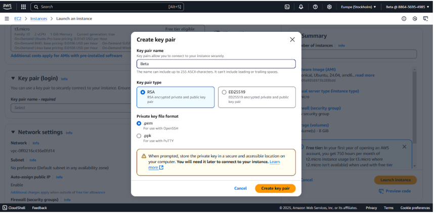

- Created a **security group** and configured necessary rules.

📸 **Screenshots:**  
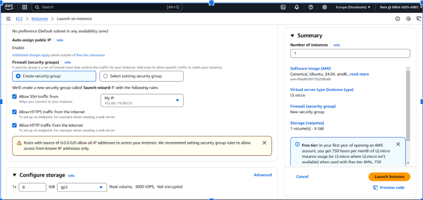  
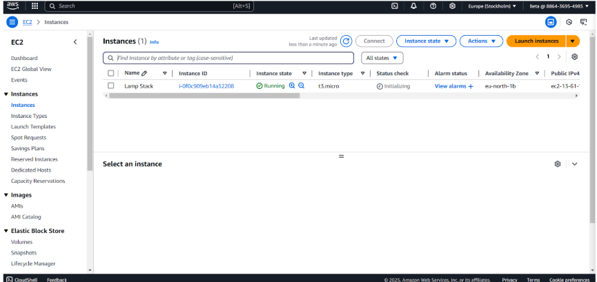

- Successfully launched and connected to the instance using **MobaXterm**.

📸 **Screenshots:**  
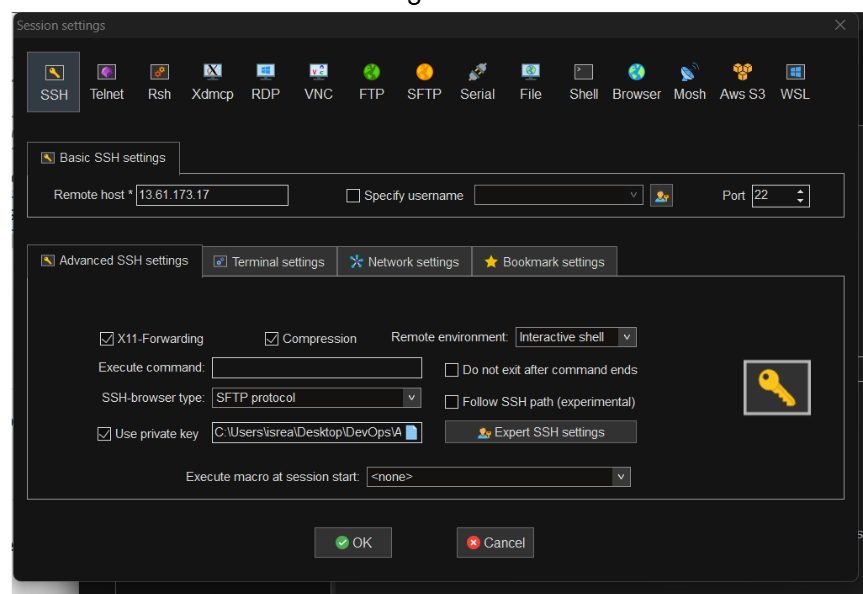  

---

### 🔹 System Preparation
- Updated and upgraded system packages.

📸 **Screenshot:**  
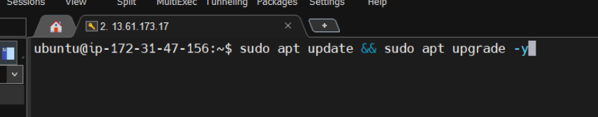

---

### 🔹 Apache Installation and Setup
- Installed **Apache**.

📸 **Screenshot:**  
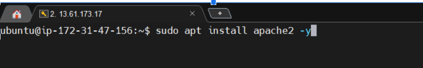

- Started, enabled, and checked the **Apache service status**.

📸 **Screenshot:**  
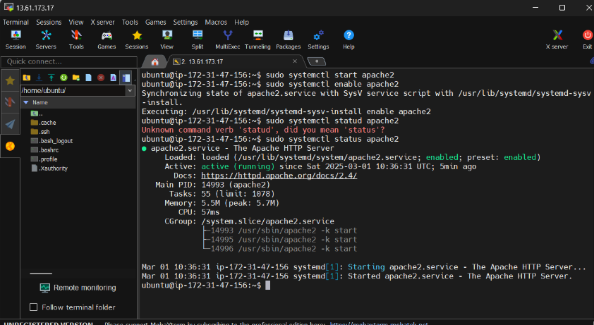

- Verified that **Apache is running** using the public IP address.

📸 **Screenshot:**  
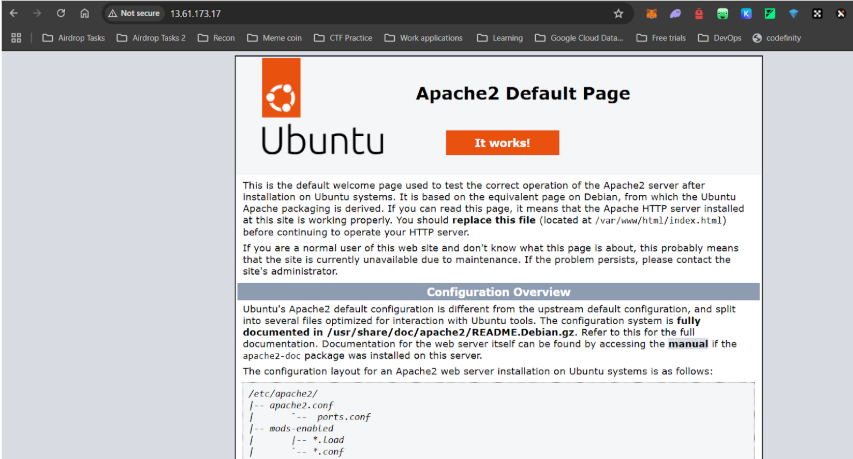

---

### 🔹 MySQL Installation
- Installed **MySQL**.

📸 **Screenshot:**  
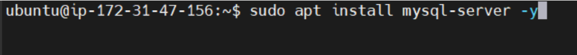

---

### 🔹 PHP Installation and Configuration
- Installed **PHP**.

📸 **Screenshot:**  
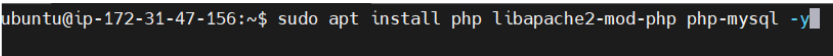

- Verified the **PHP installation**.

📸 **Screenshot:**  
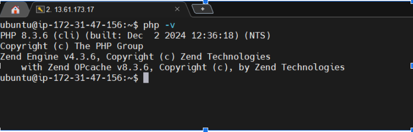

- Created a **PHP info file**.

📸 **Screenshot:**  
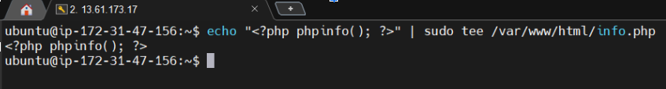

- Verified the **stack operation** by accessing the PHP info file in the browser.

📸 **Screenshot:**  
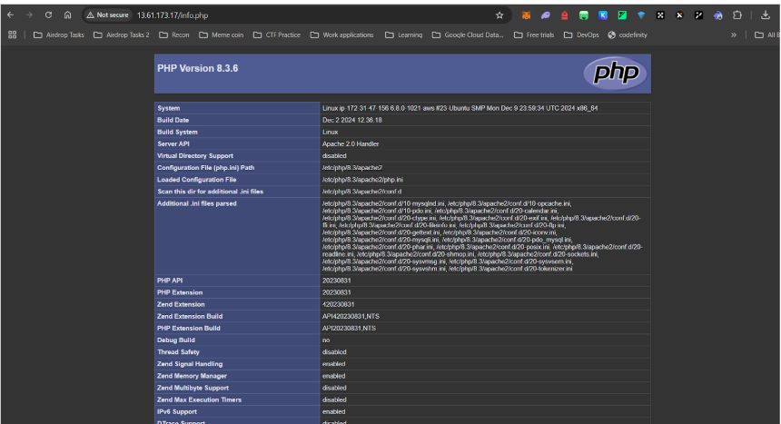

---

## 🎯 Conclusion
This guide provides a **fully functional LAMP stack** on AWS EC2 with proper configurations. The included screenshots help visualize each step for easy verification.

💡 **Next Steps:** Explore **LEMP stack setup** by following the [LEMP Guide](LEMP_Setup.md).

