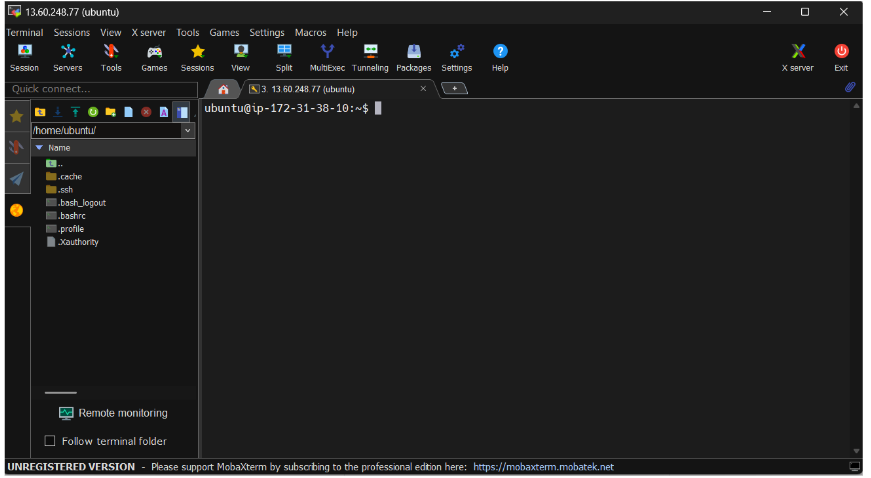
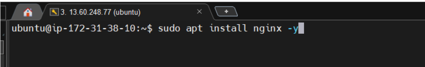
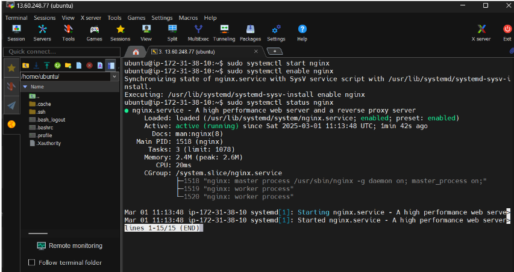
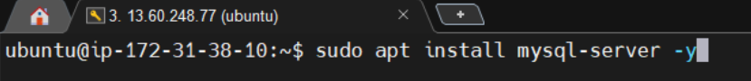
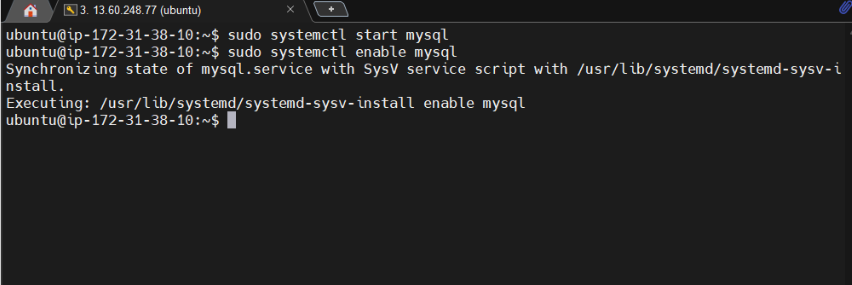
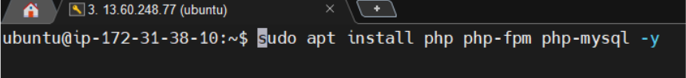
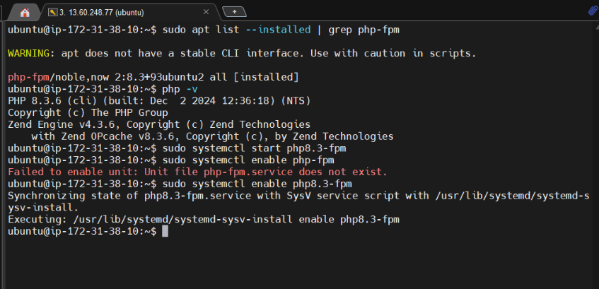
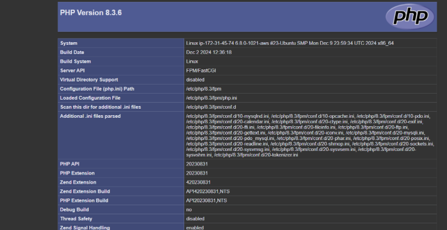

Part 2: Setting Up LEMP Stack

- Instance Setup
Created a new EC2 instance and connected via SSH.

- Nginx Installation and Setup

Installed Nginx.

Started, enabled, and checked the Nginx service status.

MySQL Installation

Installed MySQL.

Started and enabled the MySQL service.

-PHP Installation and Configuration

Installed PHP.

Started and enabled the PHP service.
Fetched the specific PHP version and manually starting it.

- Nginx and PHP Integration
Configured Nginx to support PHP.

Created a PHP info file and confirmed successful stack setup by accessing the PHP info file in the browser.
