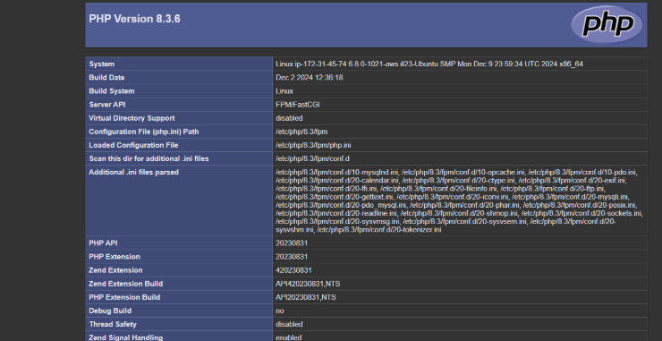

# 🚀 LAMP & LEMP Stack Setup

## 📖 Overview
This repository contains setup guides for **LAMP (Linux, Apache, MySQL, PHP)** and **LEMP (Linux, Nginx, MySQL, PHP)** stacks on an **AWS EC2 Ubuntu instance**. These guides provide step-by-step instructions, configurations, and troubleshooting solutions.

## 📂 Documentation
- [📘 LAMP Stack Setup](LAMP_Setup.md) – Install and configure Apache, MySQL, and PHP.
- [📗 LEMP Stack Setup](/LEMP_Setup.md) – Install and configure Nginx, MySQL, and PHP.

## 🛠️ Prerequisites
Before setting up, ensure you have:
- An **AWS EC2 Ubuntu instance** running.
- **SSH access** to the instance.
- Basic knowledge of Linux commands.

## 🎯 Key Steps
- **LAMP Setup:**
  - Install **Apache**, **MySQL**, and **PHP**.
  - Configure virtual hosts and verify the setup.
- **LEMP Setup:**
  - Install **Nginx**, **MySQL**, and **PHP-FPM**.
  - Configure Nginx for PHP processing.

## 📸 Screenshots
| Description | Screenshot |
|------------|-----------|
| Apache Running |  |
| PHP Info Page |  |
| Nginx Running |  |

## 🔗 Resources
- [AWS EC2 Documentation](https://docs.aws.amazon.com/ec2/)
- [Apache Documentation](https://httpd.apache.org/docs/)
- [Nginx Documentation](https://nginx.org/en/docs/)
